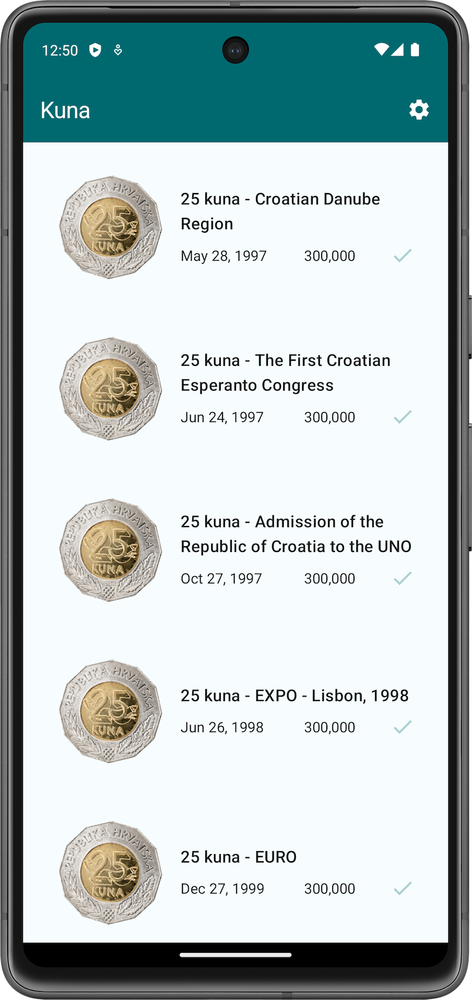

# Kuna

 <!-- x-release-please-version -->

Croatian commemorative 25 kuna coins collection.

Source: [HNB](https://www.hnb.hr/en/currency/kuna/coins/commemorative-coins-in-circulation)

Modern Android application built with Jetpack Compose.

## 🛠️ Tech Stack & Libraries

- **UI:** Jetpack Compose (Material 3)
- **Dependency Injection:** Koin (BOM-based)
- **Database:** Room (using KSP for compilation)
- **Networking:** Ktor Client (Android engine + Kotlinx Serialization)
- **Async/Threading:** Kotlin Coroutines & Flow
- **Image Loading:** Coil
- **Logging:** Timber

## 📐 Architecture

The project is built following **Clean Architecture** and MVVM design patterns:
- **`core/`**: Shared components including database, repository interfaces, domain models, and global UI styling.
- **`feature/`**: Package-by-feature directories containing UI screens, ViewModels, and feature-specific logic (e.g., `kunalist`, `settings`).

## 🚀 Getting Started

### Prerequisites
- **JDK 17** (configured via Gradle toolchain)
- **Android Studio** (Koala or newer recommended)

### Build Commands
Run these commands from the root directory:
- **Build the debug app:** `./gradlew assembleDebug`
- **Build the optimized release app:** `./gradlew assembleRelease`
- **Run local unit tests:** `./gradlew test`
- **Run instrumentation tests on release:** `./gradlew connectedAndroidTest`
- **Clean build artifacts:** `./gradlew clean`

## 📦 GitHub Release

Release Please GitHub Action maintains Release PRs on each push to the main branch.

* Project CHANGELOG.md is generated from Conventional Commits.
* Semantic release version is automatically updated in app build.gradle.kts and here in README.

Once a release PR is merged, Release Please tags the new release commit and creates a corresponding
GitHub Release based on the tag.
