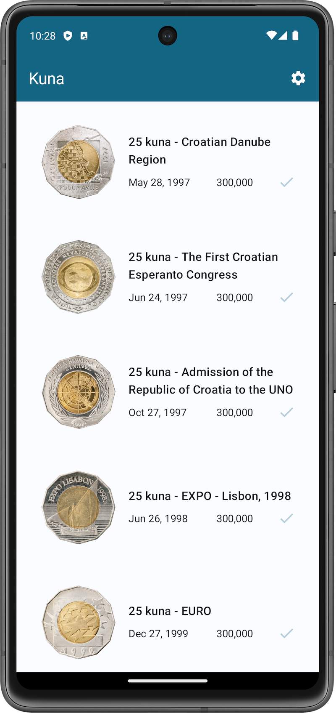

# Kuna

 <!-- x-release-please-version -->

Croatian commemorative 25 kuna coins collection.

Source: [HNB](https://www.hnb.hr/en/currency/kuna/coins/commemorative-coins-in-circulation)

Modern Android application built with Jetpack Compose.

## GitHub Release

Release Please GitHub Action maintains Release PRs on each push to the main branch.

* Project CHANGELOG.md is generated from Conventional Commits.
* Semantic release version is automatically updated in app build.gradle.kts and here in README.

Once a release PR is merged, Release Please tags the new release commit and creates a corresponding
GitHub Release based on the tag.
